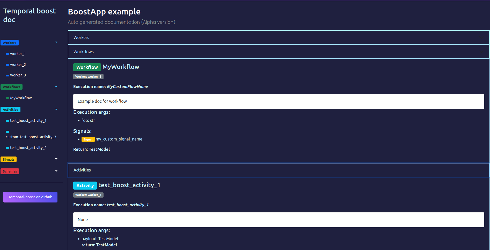

# Creating application

## Base code example

This\`s the base code snippet to start working with the framework. Create `BoostApp` object, set configuration for an app and run it.

```python
# Creating `BoostApp` object

from temporal_boost import BoostApp, BoostLoggerConfig, BoostOTLPConfig

app: BoostApp = BoostApp(
    name="BoostApp example", # Name of the service
    temporal_endpoint="localhost:7233", # Temporal endpoint
    temporal_namespace="default", # Temporal namespace
    logger_config=BoostLoggerConfig(
        json=True,
        bind_extra={"foo": "bar",},
        level="DEBUG",
        multiprocess_safe=True
    ),    
    otlp_config=BoostOTLPConfig(
        otlp_endpoint="otlp-collector",
        service_name="example-app"
    ),
    use_pydantic=True # Use special JSON serializer inside Temporal SDK
)
```
### BoostLoggerConfig

BoostLoggerConfig is an object with setting for internal logger, based on loguru. There are the description:

Logs output. Can be io object of filename
> ```sink: typing.TextIO = sys.stdout```

Log severity
> ```level: str = "DEBUG" ```

Internal seriallizer for logs
> ```json: bool = True ```

We use internal formatter, but ypu can provide anyone
> ```formatter: typing.Callable | str = _default_json_formatter```

Enqueue mode of loguru. Use it in async and muliprocess apps
> ```multiprocess_safe: bool = True```

Dict, that you can fill with anythind you want. It\`ll be added to `extra` field of log format
> ```bind_extra: dict | None = None```


### BoostOTLPConfig

Similar to BoostLoggerConfig, BoostOTLPConfig is an object with setting for OTLP tracer. This tracer will be provided for original Tempral SDK tracer too.

OTLP collector endpoint
> ```otlp_endpoint: str```

OTLP service name
> ```service_name: str | None = None```

## Adding temporal workers

For adding worker to the app, you should use `add_worker` method. There are arguments for it:

```python
def add_worker(
    self,
    worker_name: str,
    task_queue: str,
    workflows: list = [],
    activities: list = [],
    cron_schedule: str | None = None,
    cron_runner: typing.Coroutine | None = None,
    metrics_endpoint: str | None = None,
    description: str = "",
) -> None:
```
Name of the worker. Should be unique for the app and non-matching with TemporalBoost system worker names


!!! warning annotate "There some prohibited worker name, which are using for system purposes"

    * *all*
    * *internal*

> ```worker_name: str```

Task queue, there activities and workflows of this worker will`be registered.
> ```task_queue: str```

List of workflows for this worker, defaults to []
> ```workflows: list = []```

List of activities for this worker, defaults to []
> ```activities: list = []```

Cron schedule string, if you want to create cron worker, ex `* * * * *`
> ```cron_schedule: str | None = None```

Workflow `run` method, which will be executed, if you created cron worker. Required, if `cron_schedule` is not `None`
> ```cron_runner: typing.Coroutine | None = None```

Prometheus metrics endpoint for this worker. Should looks like `0.0.0.0:9000`
> ```metrics_endpoint: str | None = None```

Non-nessesary description for the worker
> ```description: str = ""```


### Examples
```python
app.add_worker(
    "my_worker_1",
    "my_queue_1",
    activities=[my_activity],
    metrics_endpoint="0.0.0.0:9000",
    description="This workers serves activity my_activity on my_queue_1 and metrics endpoint"
)
app.add_worker(
    "worker_2",
    "my_queue_2",
    workflows=[MyWorkflow],
    description="This workers serves workflow MyWorkflow on my_queue_2"
)
app.add_worker(
    "worker_3",
    "my_queue_3",
    workflows=[MyWorkflow2],
    activities=[my_activity2],
    description="This workers serves workflow MyWorkflow3 and activity my_activity2 on my_queue_3"
)

```

## Adding CRON workers

To execute some workflow with cron schedule, create cron worker like this:
```python
app.add_worker(
    "worker_4",
    "task_q_4",
    workflows=[MyWorkflow],
    cron_runner=MyWorkflow.run,
    cron_schedule="* * * * *"
)
```
!!! note annotate "About arguments"
    Here, `cron_runner` is a corutine, which will be started with `cron_schedule`

## Adding internal worker

Now, internal worker can be used for autogenerated documentation for Temporal objects

In future, opportunities of this object will be expanded 

```python
app.add_internal_worker("0.0.0.0", 8888, doc_endpoint="/doc")
```

Now, go to [http://localhost:8888/doc](http://localhost:8888/doc) and use autogenerated documentation for workers, workflows, activities and other temporal objects.

!!! warning annotate "This documentation as a prototype in Alpha version"



## Adding ASGI workers

To add [FastAPI](https://github.com/fastapi/fastapi) application as an ASGI worker to your application at first you should add something like this:

```python
from fastapi import FastAPI, Response

fastapi_app: FastAPI = FastAPI(docs_url="/doc")
```

Now, you can add it to Temporal-boost application:

```python
app.add_asgi_worker("asgi_worker", fastapi_app, "0.0.0.0", 8000)
```

This application will be executed with [Hypercorn](https://github.com/pgjones/hypercorn) + [Trio](https://github.com/python-trio/trio) in asyncio runtime